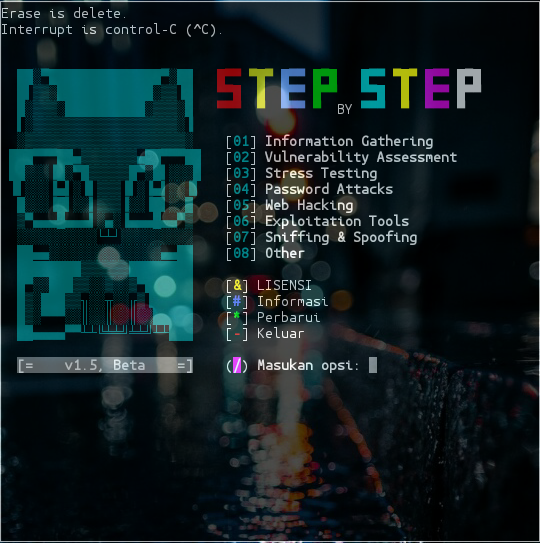

# Stepbystep:
Stepbystep merupakan sebuah kumpulan berbagai macam tool di dalamnya, tool ini di buat dengan sejuta cita dan rasa. Mungkin bagi sebagian orang yang skilnya di bilang pro tool ini gx ada apa-apanya sebut saja sampah, tapi seburuk apapun itu tolong hargai karaya milik orang dan saya tidak rela kalo code program sampah ini di tiru
#### Screenshot:

#### Informasi:
```
Nama        : Stepbystep
Versi       : 1.5 (Update: 17 November 2020, 6:30 PM)
Tanggal     : 07 Mei 2019
Author      : Nedi Senja
Tujuan      : Sengaja di encrypt biar simpel
              kumpulan tool termux
Terimakasih : Allah SWT.
              FR13NDS, & seluruh
              manusia seplanet bumi
NB          : Manusia gax ada yang sempurna
              sama kaya tool ini.
              Silahkan laporkan kritik atau saran
              Ke - Email: d_q16x@outlook.co.id
                 - WhatsApp: +62 8577-5433-901

[ Gunakan tool ini dengan bijak ]
````
#### Fitur:
+ Information Gathering
+ Vulnerability Assessment
+ Stress Testing
+ Password Attacks
+ Web Hacking
+ Exploitation Tools
+ Sniffing & Spoofing
+ Others
##### Cara Menginstall:
```
git clone https://github.com/stepbystepexe/Stepbystep
cd Stepbystep
ls
bash stepbystep.sh
```
#### Kontak:
+ Email d_q16x@outlook.co.id
+ WhatsApp https://tinyurl.com/wel4alo
#### Paypal:
+ Onclick https://bit.ly/3dcEQcN
### LiberaPay:
<noscript><a href="https://liberapay.com/stepbystepexe/donate"></a></noscript>
>**Created by Nedi Senja**
